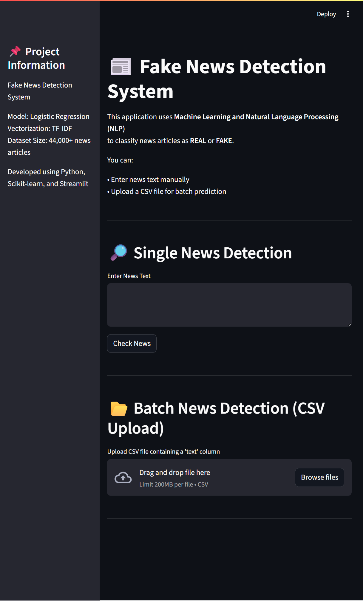
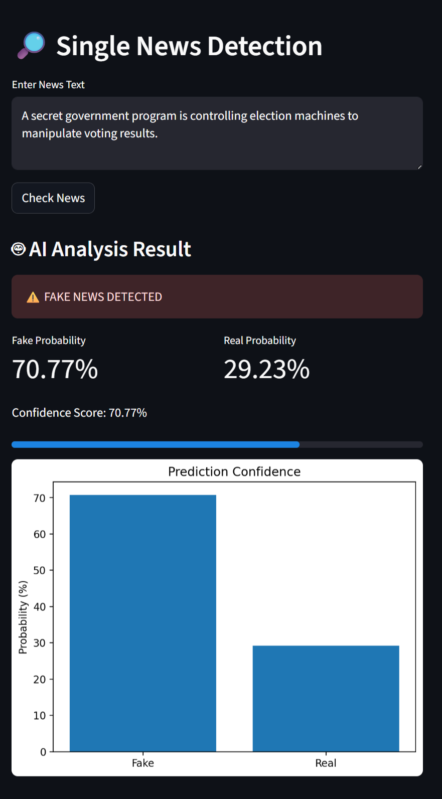
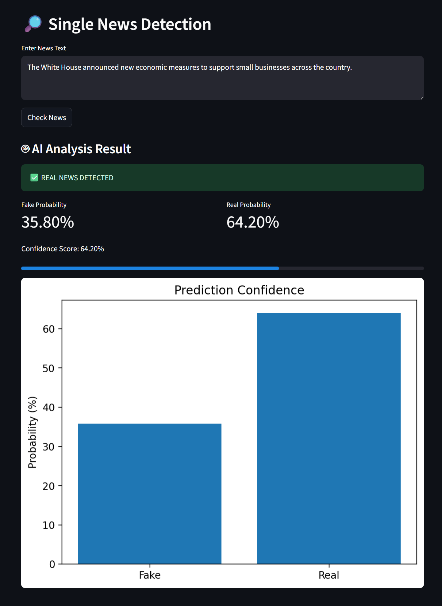
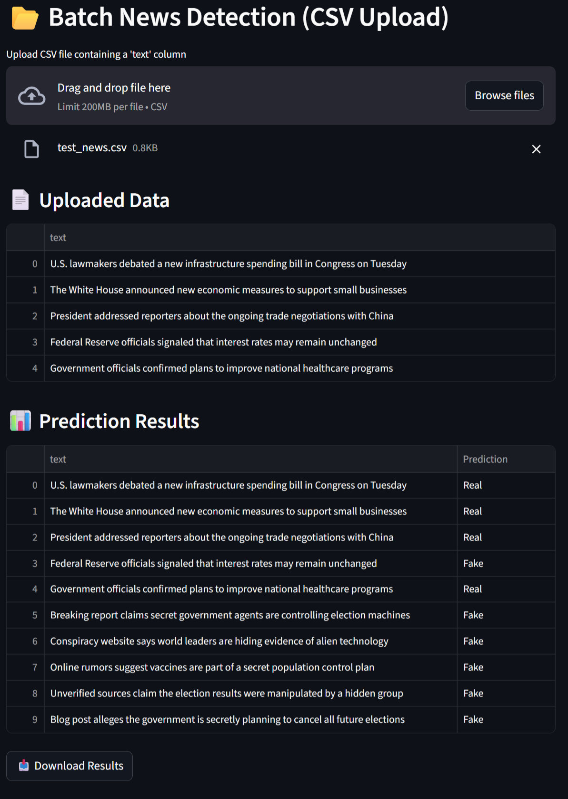

📰 Fake News Detection System

📌 Project Overview

The Fake News Detection System is a Machine Learning based application that classifies news articles as Real or Fake using Natural Language Processing (NLP).

The model is trained on a dataset containing real and fake news articles and deployed using a Streamlit web application that allows users to verify the authenticity of news text.

This project demonstrates a complete end-to-end machine learning workflow, including data preprocessing, model training, and web application deployment.

🚀 Features

* Detect whether news text is Real or Fake
* Display prediction confidence score
* Batch news detection using CSV file upload
* Download prediction results as a CSV file
* Simple and interactive Streamlit user interface

🧠 Machine Learning Approach

The system uses Natural Language Processing techniques to analyze news text.

#Workflow

1. Data Collection
2. Data Preprocessing and Cleaning
3. Text Vectorization using **TF-IDF**
4. Model Training using **Logistic Regression**
5. Model Serialization using **Pickle**
6. Web Application Deployment using **Streamlit**

📊 Model Performance

| Metric     | Result              |
| ---------- | ------------------- |
| Algorithm  | Logistic Regression |
| Vectorizer | TF-IDF              |
| Accuracy   | ~98%                |

🛠 Technologies Used

* Python
* Pandas
* Scikit-learn
* Streamlit
* TF-IDF Vectorization
* Logistic Regression
* Pickle
* Git & GitHub

📂 Project Structure

Fake_News_Detector
│
├── app.py
├── train_model.py
├── prepare_dataset.py
├── requirements.txt
├── README.md
├── .gitignore
│
└── screenshots
    ├── app_full_page.png
    ├── batch_detection.png
    ├── fake_news_prediction.png
    └── real_news_prediction.png

📸 Application Screenshots

Application Interface

Fake News Prediction

Real News Prediction

Batch News Detection

⚙️ Installation and Setup

#Clone the Repository
git clone https://github.com/mansi-patel412/fake_news_detector.git

#Navigate to the Project Folder
cd fake_news_detector

#Install Dependencies
pip install -r requirements.txt

#Run the Application
streamlit run app.py

📊 Dataset

The model was trained on a dataset containing real and fake news articles (44,000+ records)
Due to GitHub file size (dataset>100MB) limitations, dataset files are excluded from the repository using `.gitignore`.

👩‍💻 Author
Mansi Patel

